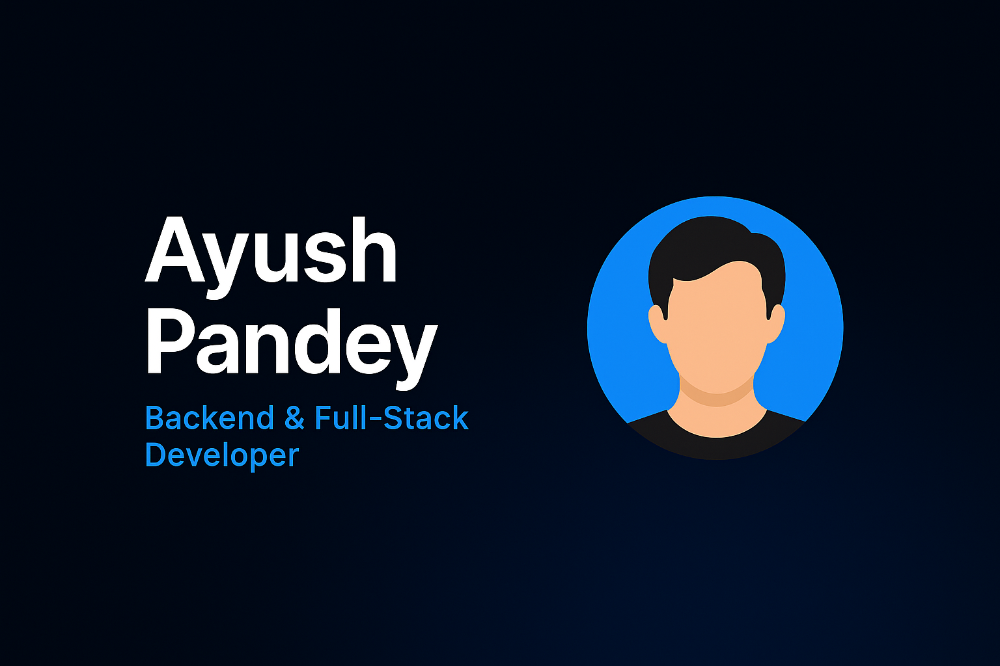

# Ayush Pandey - Personal Portfolio



A modern, responsive portfolio website built with Next.js and TailwindCSS, featuring smooth animations, dynamic content, and robust security features.

## 🌟 Features

### 💻 Technical Features
- **Modern Tech Stack**: Built with Next.js 14, React, and TailwindCSS
- **Smooth Animations**: Powered by Framer Motion for fluid transitions and interactions
- **Responsive Design**: Fully responsive across all devices and screen sizes
- **Performance Optimized**: Optimized images, lazy loading, and efficient code splitting
- **SEO Ready**: Implemented meta tags, JSON-LD, sitemap.xml, and robots.txt
- **Type Safe**: Leveraging TypeScript for better code quality and developer experience

### 🎨 UI/UX Features
- **Dark Theme**: Modern dark theme with cyan accents
- **Smooth Scrolling**: Enhanced scrolling experience using Lenis
- **Interactive Elements**: Hover effects, animations, and micro-interactions
- **Loading States**: Visual feedback for all user interactions
- **Particle Effects**: Interactive background particles using tsParticles

### 🛡️ Security Features
- **Form Protection**: 
  - Honeypot fields
  - Rate limiting
  - CAPTCHA verification
- **HTTP Security Headers**:
  - Content Security Policy (CSP)
  - HSTS
  - X-Frame-Options
  - And more...

## 🚀 Sections

1. **Hero**: Dynamic introduction with particle effects
2. **About**: Personal introduction and background
3. **Projects**: Showcase of key projects with live demos
4. **Skills**: Technical skills and expertise
5. **Stats**: GitHub statistics and coding metrics
6. **Contact**: Contact form with social media links

## 🛠️ Tech Stack

- **Framework**: Next.js 14
- **Styling**: TailwindCSS
- **Animations**: Framer Motion
- **Icons**: React Icons
- **Deployment**: Vercel
- **Form Handling**: Web3Forms
- **Particles**: tsParticles
- **Smooth Scroll**: Lenis

## 📦 Installation & Setup

1. **Clone the repository**
   ```bash
   git clone https://github.com/AyushPandey4/portfolio.git
   cd portfolio
   ```

2. **Install dependencies**
   ```bash
   npm install
   ```

3. **Set up environment variables**
   Create a `.env.local` file in the root directory:
   ```env
   NEXT_PUBLIC_EMAIL=your-email@example.com
   NEXT_PUBLIC_LINKEDIN_URL=your-linkedin-url
   NEXT_PUBLIC_GITHUB_URL=your-github-url
   NEXT_PUBLIC_X_URL=your-twitter-url
   NEXT_PUBLIC_INSTAGRAM_URL=your-instagram-url
   NEXT_PUBLIC_LEETCODE_PROFILE=your-leetcode-url
   ```

4. **Run the development server**
   ```bash
   npm run dev
   ```

5. **Build for production**
   ```bash
   npm run build
   ```

## 🌐 Deployment

The site is deployed on Vercel. You can visit it at [https://ayushportfolio-taupe.vercel.app/](https://ayushportfolio-taupe.vercel.app/)

## 📝 License

This project is open source and available under the [MIT License](LICENSE).

## 🤝 Contact

- Portfolio: [https://ayushportfolio-taupe.vercel.app/](https://ayushportfolio-taupe.vercel.app/)
- Twitter: [@ayush130206](https://twitter.com/ayush130206)
- LinkedIn: [Your LinkedIn]
- GitHub: [Your GitHub]

## 🙏 Acknowledgments

- [Framer Motion](https://www.framer.com/motion/) for animations
- [TailwindCSS](https://tailwindcss.com/) for styling
- [React Icons](https://react-icons.github.io/react-icons/) for icons
- [Web3Forms](https://web3forms.com/) for form handling
- [tsParticles](https://particles.js.org/) for particle effects
- [Studio Freight](https://github.com/studio-freight/lenis) for smooth scrolling

---

Made with ❤️ by Ayush Pandey
